# Design Overview: Neon Flight Booking System

> **Agents:** start at [AGENTS.md](../AGENTS.md) §Navigation — use this doc for architecture, flows (§3), API (§4), and the component map (§8).

> **Status:** Reflects current implementation  
> **Last updated:** 2026-05-30  
> **Related:** [final_requierments.md](final_requierments.md) · [README.md](../README.md)

---

## 1. System context

Neon is a multi-flight seat reservation system. Each order is owned by a single Temporal workflow that orchestrates seat holds, a continuous hold timer, and simulated payment validation. A Go REST API exposes booking operations to a static web frontend.

| Concern | Implementation |
|---------|----------------|
| API server | Go + Gin (`cmd/api`) |
| Orchestration | Temporal `BookingWorkflow` (namespace `flight-booking`, task queue `booking-task-queue`) |
| Persistence (MVP) | In-memory `FlightRepository` and `SeatRepository`, seeded at startup |
| Frontend | Embedded static HTML/JS/CSS served by the API |
| Auth | None — anonymous multi-user; concurrent holds allowed |

**Base URL:** `http://localhost:8080` (default)  
**API prefix:** `/api/v1`

**Temporal** ([temporal.io](https://temporal.io/)) is a third-party workflow orchestration platform (server + Go SDK). `BookingWorkflow` in `internal/workflow/booking/` is Neon application code running on that platform — not a Temporal built-in.

### Platform overview

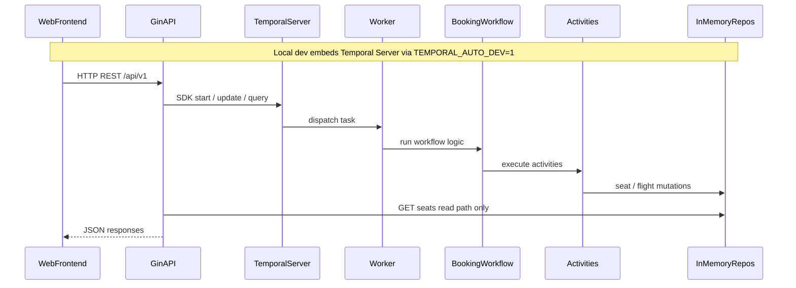

---

## 2. Architecture

### 2.1 Three-tier model

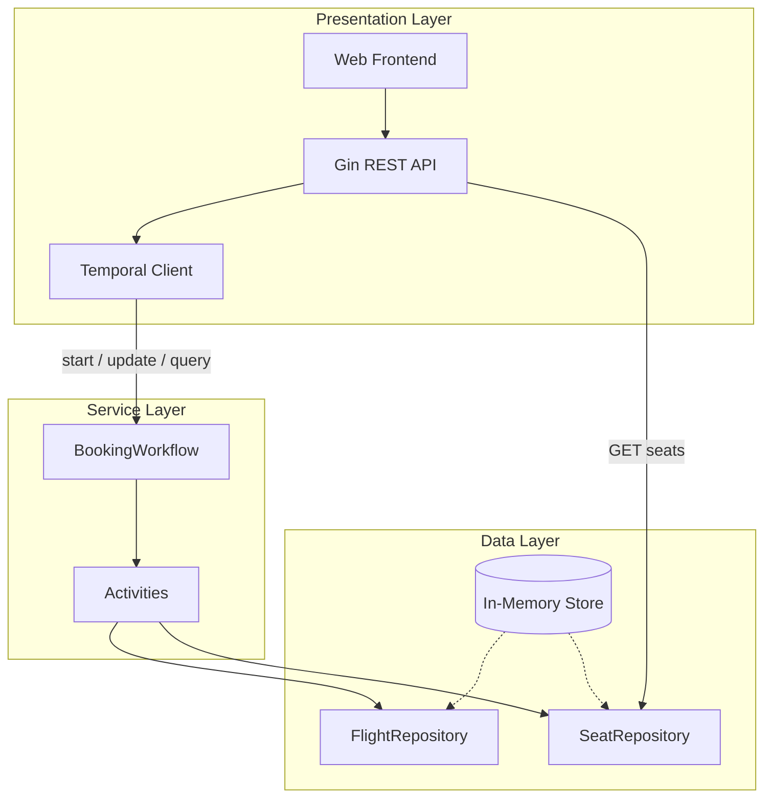

| Layer | Responsibility |
|-------|----------------|
| **Presentation** | HTTP routing, request validation, DTO mapping, Temporal client calls, static UI |
| **Service** | Order state machine, hold timer, payment retry logic, selector loop |
| **Data** | Flight catalog and per-flight seat inventory (`TryHold`, `Release`, `Confirm`) |

**Read/write split:** Seat map reads bypass Temporal. All seat mutations go through workflow activities.

### 2.2 Temporal integration

| Operation | Temporal mechanism | Used by |
|-----------|-------------------|---------|
| Create order | `ExecuteWorkflow` | `POST /orders` |
| Update seats | Workflow update `UpdateSeats` | `PATCH /orders/{id}/seats` |
| Cancel order | Workflow update `CancelOrder` | `POST /orders/{id}/cancel` |
| Submit payment | Workflow update `SubmitPayment` | `POST /orders/{id}/payment` |
| Read order | Query `GetStatus` | `GET /orders/{id}`, SSE stream |

Workflow ID equals `order_id` (UUID, 1:1 mapping).

**Write path vs read path:**

```mermaid
sequenceDiagram
  participant API as GinAPI
  participant TC as TemporalClient
  participant WF as BookingWorkflow
  participant SR as SeatRepository

  Note over API,WF: Mutations — always through workflow updates
  API->>TC: UpdateWorkflow UpdateSeats / SubmitPayment / CancelOrder
  TC->>WF: synchronous handler
  WF-->>TC: StatusResponse
  TC-->>API: completed update

  Note over API,SR: Reads — order state via query; seat map direct
  API->>TC: QueryWorkflow GetStatus
  TC->>WF: read-only query
  WF-->>API: status snapshot

  API->>SR: GET /flights/id/seats no Temporal round-trip
  SR-->>API: seat map
```

### 2.3 Order state machine

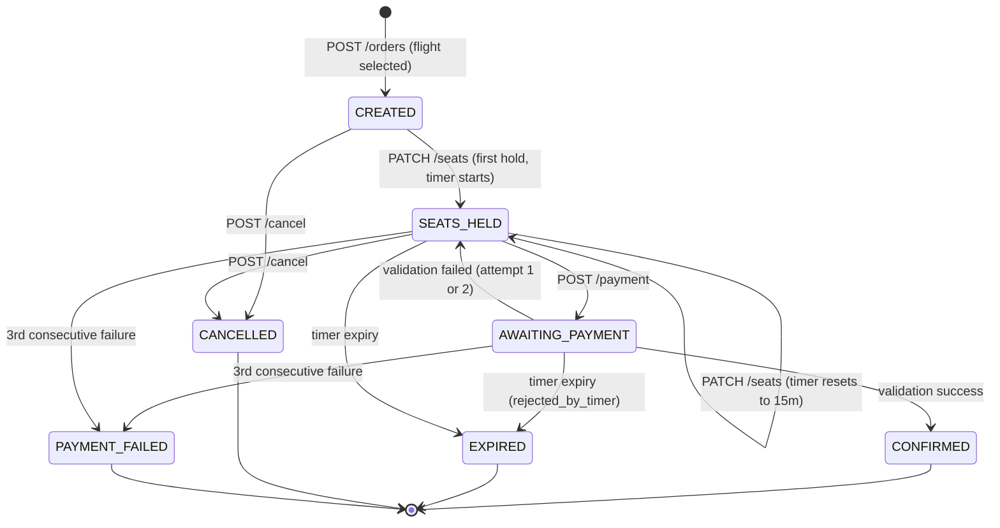

| Status | Terminal | Description |
|--------|----------|-------------|
| `CREATED` | No | Order started when user selects a flight; **no timer**; no seats held |
| `SEATS_HELD` | No | One or more seats held; timer running (started or reset on seat change) |
| `AWAITING_PAYMENT` | No | Payment activity in progress; timer still running |
| `CONFIRMED` | Yes | Payment succeeded; seats booked |
| `EXPIRED` | Yes | Hold timer reached zero while seats were held; seats released |
| `CANCELLED` | Yes | User cancelled; seats released |
| `PAYMENT_FAILED` | Yes | 3 consecutive failed payment attempts; seats released |

### 2.4 Seat states

| Status | Meaning |
|--------|---------|
| `AVAILABLE` | Open for booking |
| `HELD` | Reserved by an active order |
| `BOOKED` | Confirmed after successful payment |

Inventory is isolated per `flight_id`. Seat `1A` on flight `NA4821` is independent from `1A` on flight `NA1954`.

### 2.5 Hold timer rules

- **Starts** on the first successful `PATCH /orders/{id}/seats` with non-empty seats (default **15 minutes**, overridable via `HOLD_DURATION`). The `CREATED` state has no running timer (`timer_remaining_seconds: 0`).
- **Resets to full duration** on every subsequent `PATCH /orders/{id}/seats`.
- **Never pauses** during payment validation (`AWAITING_PAYMENT`).
- On expiry: in-flight payment is rejected (`rejected_by_timer` event), held seats are released, order becomes `EXPIRED`.

### 2.6 Payment rules (implementation)

| Rule | Value |
|------|-------|
| Code format | Exactly 5 digits (`0`–`9`) |
| Validation timeout | 10 seconds (activity `StartToCloseTimeout`) |
| Simulated failure rate | 15% (override via `PAYMENT_*` env vars in dev/test) |
| Max consecutive failures | **3** — any 3 failed attempts in a row → `PAYMENT_FAILED`, seats released |
| Failure message | `"The maximum payment retries is reached the booking process is cancelled."` |

Activity timeouts: **30 seconds** for seat activities (`SwapSeats`, `ReleaseSeats`, `ConfirmSeats`); **10 seconds** for `ValidatePayment`.

### 2.7 Design decisions and assumptions

#### 2.7.1 Assumptions

- **Anonymous users** — no auth; identity is client-side only via `localStorage` order ID (`neon_order_id`).
- **Single-process MVP** — strong seat consistency within one API/worker process; multi-instance requires durable storage.
- **Simulated payment** — RNG-based failure with `PAYMENT_*` env overrides; no real PCI scope.
- **One active booking per browser** — UI-enforced in `flights.js`; not server-enforced.
- **Temporal dev server** — embedded locally (`TEMPORAL_AUTO_DEV=1`); production Temporal cluster is out of MVP scope.
- **Restart tolerance** — in-memory inventory is lost on restart except **HELD** seats replayed from running workflows via `ReconcileInventory`; **BOOKED** seats from `CONFIRMED` workflows are not replayed (MVP limitation).
- **Flight departure** — does not auto-cancel orders; timer and payment may continue until expiry or success ([final_requierments.md](final_requierments.md) §2.3).
- **Postgres scaffold** — `docker-compose.yml` exists but is not wired to the Go application.

#### 2.7.2 Decision records

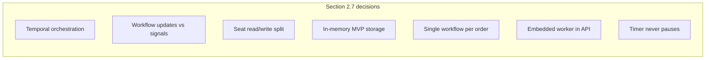

##### D-1: Temporal orchestration for order lifecycle

**Chosen:** One [Temporal.io](https://temporal.io/) `BookingWorkflow` per order owns timer, holds, payment, and expiry (`internal/workflow/booking/workflow.go`).

| Option | Pros | Cons |
|--------|------|------|
| **A (chosen): Temporal workflow** | Durable timers; crash recovery; matches requirements (`temporal server start-dev`); simplifies S-4 timer/payment race | Operational dependency on Temporal server; learning curve |
| **B: In-process Go state machine + DB locks** | Fewer moving parts; no external server | Manual timer/retry logic; harder crash recovery and S-4 race handling |
| **C: Event-driven saga (message bus)** | Scales horizontally | More infrastructure; overkill for MVP |

**Why chosen:** [initial_requirements.md](initial_requirements.md) and [final_requierments.md](final_requierments.md) mandate Temporal orchestration. Durable workflow timers and replay handle hold expiry during in-flight payment (S-4) without custom scheduler code.

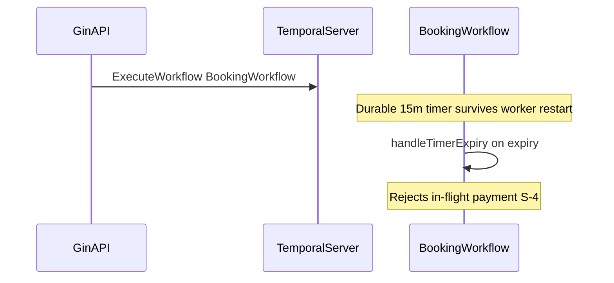

##### D-2: Workflow updates (not signals) for mutations

**Chosen:** Synchronous `UpdateWorkflow` for seats, payment, and cancel (`internal/infrastructure/temporal/order_service.go`).

| Option | Pros | Cons |
|--------|------|------|
| **A (chosen): Workflow updates** | Request/response semantics match REST; handler returns final state in one HTTP round-trip | Requires Temporal 1.20+ update support |
| **B: Signals + client polling** | Familiar async pattern | Extra poll loop; harder error mapping; duplicate state handling |

**Why chosen:** REST endpoints expect a definitive HTTP response per mutation. Updates block until the workflow handler completes, avoiding signal-delivery races and server-side poll loops.

##### D-3: Seat read/write split

**Chosen:** `GET /api/v1/flights/{flight_id}/seats` reads `SeatRepository` directly; all mutations go through workflow activities.

| Option | Pros | Cons |
|--------|------|------|
| **A (chosen): Direct read, workflow write** | Low latency seat map; fewer Temporal queries under poll load | Read path may briefly lag workflow state |
| **B: All reads via Temporal query** | Single source of truth in workflow | Higher latency; more load on Temporal for frequent seat-map refreshes |

**Why chosen:** Seat map is polled every 2 seconds on the seats page. Bypassing Temporal for reads keeps the UI responsive while activities enforce write consistency.

##### D-4: In-memory storage with hold reconciliation

**Chosen:** In-memory repositories (`internal/infrastructure/memory/`) plus startup `ReconcileInventory` (`internal/app/reconcile.go`).

| Option | Pros | Cons |
|--------|------|------|
| **A (chosen): In-memory + reconcile HELD** | Fastest MVP; repository interfaces allow Postgres later | Data lost on restart; BOOKED not replayed; single-process constraint |
| **B: Postgres from day one** | Durable inventory; safe multi-instance | Slower delivery; `docker-compose.yml` scaffold exists but no Go adapter yet |

**Why chosen:** MVP prioritizes working S-1..S-5 flows with minimal ops. `ApplyHold` reconciliation restores running workflow holds after restart; confirmed bookings need durable storage in a future phase.

##### D-5: Single workflow per order

**Chosen:** Workflow ID equals `order_id`; one `BookingWorkflow` owns the full lifecycle.

| Option | Pros | Cons |
|--------|------|------|
| **A (chosen): One workflow per order** | Matches requirements; simple queries and cancel; unified timer ownership | Large workflow code surface |
| **B: Child workflows per phase** | Smaller units | Cross-workflow timer coordination; harder cancel and status query |

**Why chosen:** Requirements state a single Temporal workflow must own the entire order lifecycle. One workflow simplifies `GetStatus` query and timer semantics.

##### D-6: Embedded Temporal dev server and worker in API

**Chosen:** Default `TEMPORAL_AUTO_DEV=1` and `EMBED_TEMPORAL_WORKER=1` in `internal/app/application.go`.

| Option | Pros | Cons |
|--------|------|------|
| **A (chosen): Embedded dev server + worker** | One command (`go run ./cmd/api`); E2E friendly | Not production topology |
| **B: Always external Temporal + separate worker** | Mirrors production | More setup for local dev and tests |

**Why chosen:** Local development and Playwright E2E spawn `go run ./cmd/api` per test. Split deploy is guarded when using in-memory seats (`ALLOW_SPLIT_INMEMORY`).

##### D-7: Hold timer never pauses during payment

**Chosen:** Timer continues during `AWAITING_PAYMENT`; expiry rejects in-flight payment (`rejected_by_timer`).

| Option | Pros | Cons |
|--------|------|------|
| **A (chosen): Timer runs during payment** | Matches S-4 requirement; fair hold window | Requires workflow race handling |
| **B: Pause timer during validation** | Simpler payment UX | Violates requirements; extends holds unpredictably |

**Why chosen:** Explicit requirement in [final_requierments.md](final_requierments.md) §2.1 and scenario S-4. Workflow handles the race inline in `handleTimerExpiry`.

##### D-8: Static embedded UI

**Chosen:** `go:embed` HTML/JS/CSS in `internal/web/`; no SPA build step.

| Option | Pros | Cons |
|--------|------|------|
| **A (chosen): Static embedded UI** | Zero frontend build; simple E2E; served from same Gin process | No component framework; demo flight metadata in `FLIGHT_DISPLAY` |
| **B: React/Vue SPA** | Rich component model | Build pipeline; separate deploy concern |

**Why chosen:** MVP scope favors simplicity. Demo routes, prices, and times in `flights.js` are UI-only; backend exposes flight ID, departure, and capacity.

---

## 3. Major flows

### 3.1 Happy path (S-1)

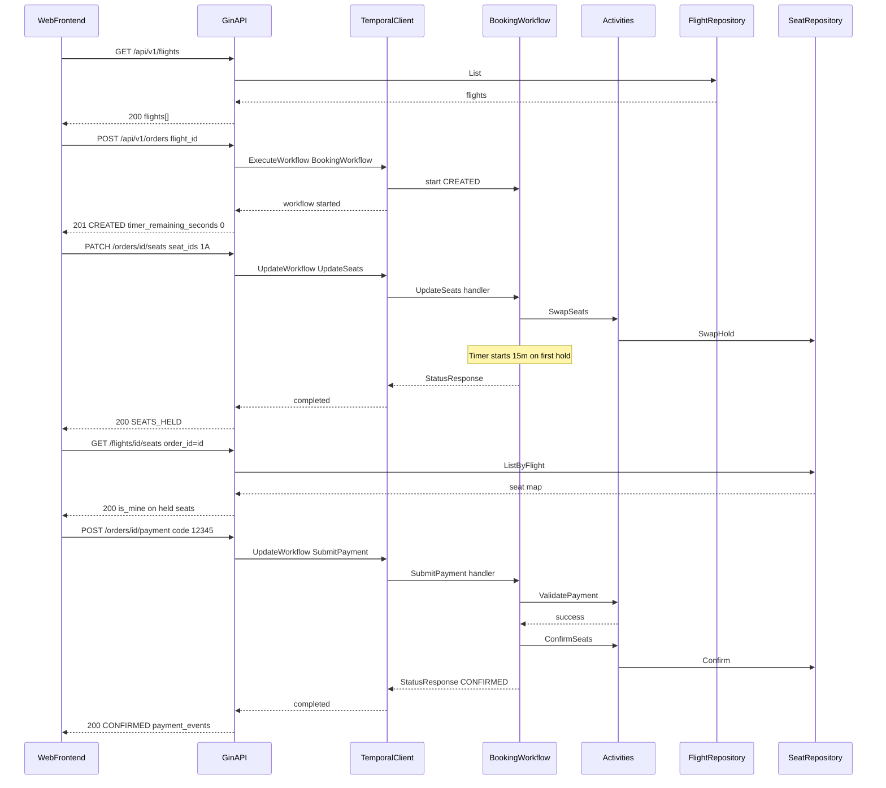

### 3.2 Timer refresh (S-2)

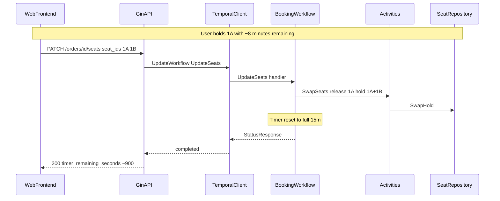

### 3.3 Payment failure and exhaustion (S-3)

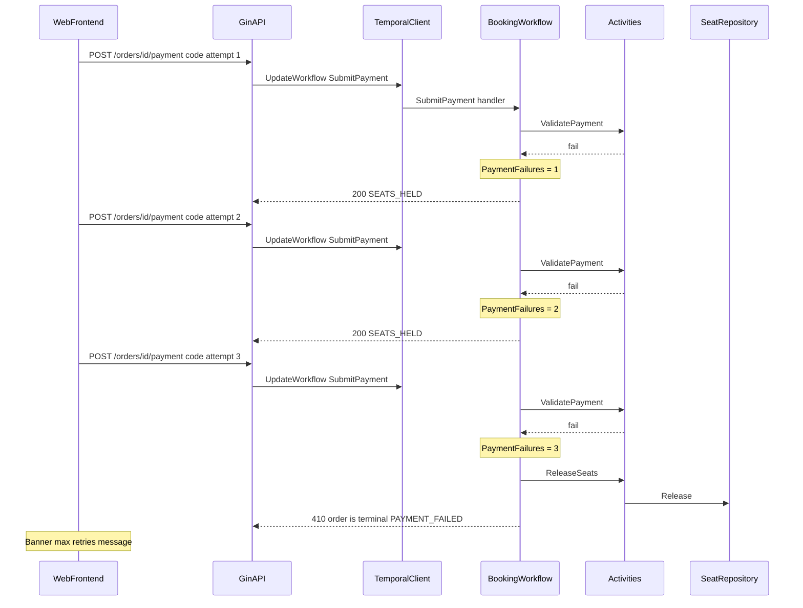

### 3.4 Timer vs payment race (S-4)

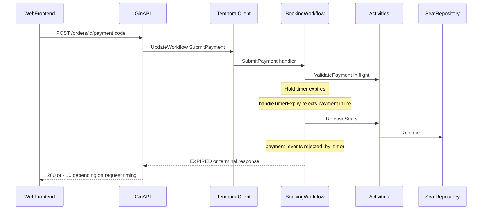

### 3.5 Multi-flight isolation (S-5)

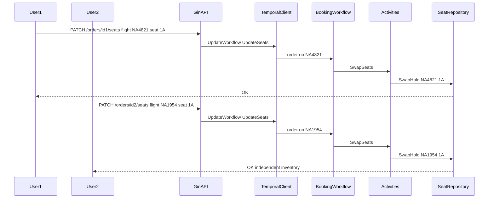

### 3.6 Startup and hold reconciliation

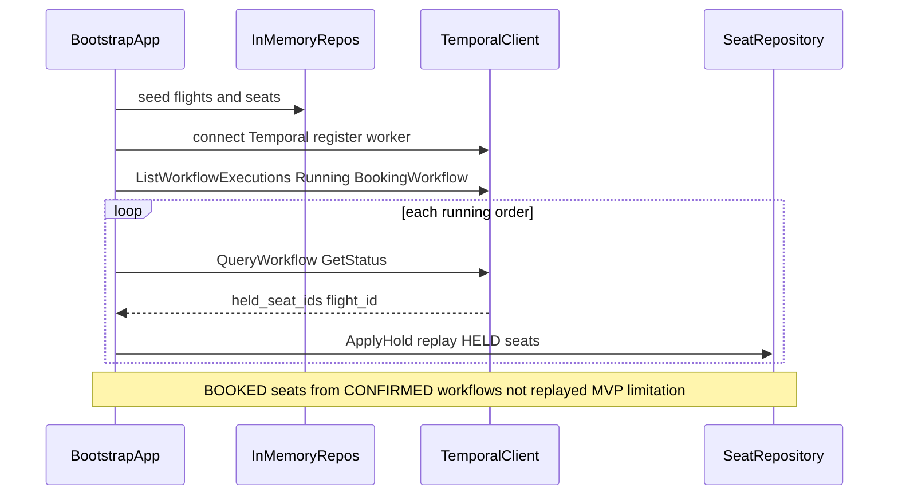

### 3.7 Cancel order

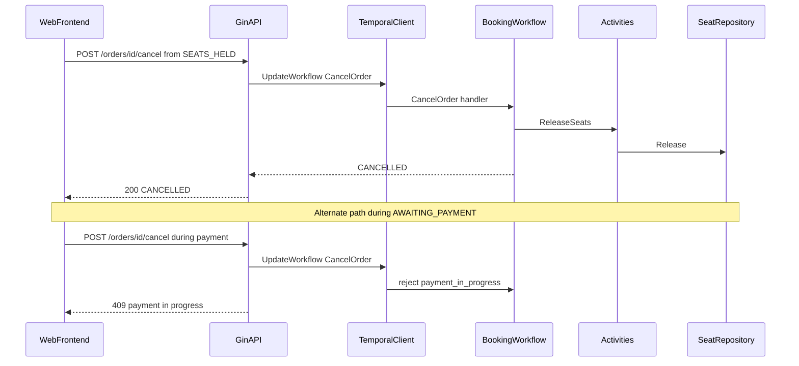

### 3.8 SSE order stream (payment page)

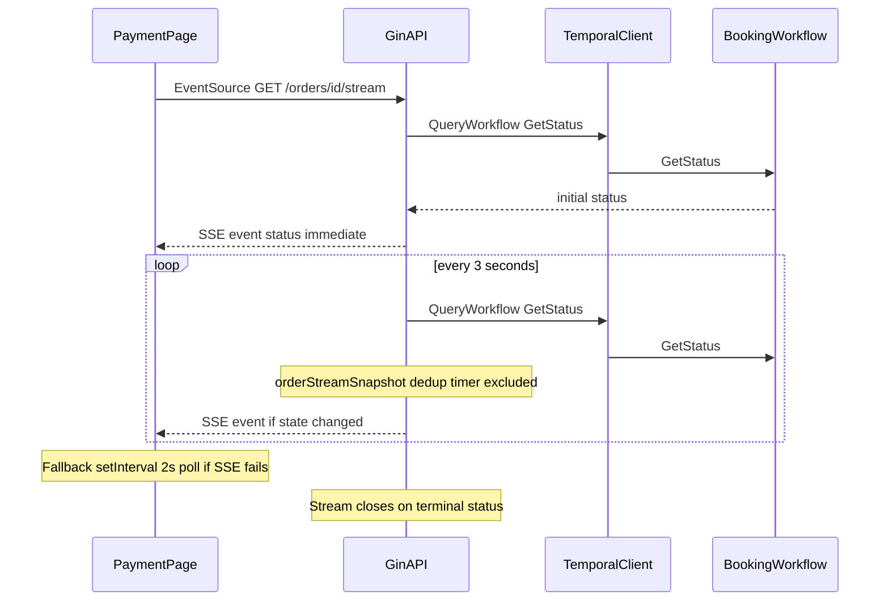

---

## 4. REST API reference

All JSON request bodies use `Content-Type: application/json`.  
All successful order responses share the **Order response** shape defined in [§4.3](#43-order-response).

Every request receives an `X-Request-ID` header (UUID generated if absent); the same value is echoed in the response and logged in structured JSON (`internal/api/router.go`).

### 4.1 Error format

Errors return a JSON object with a single `error` string:

```json
{ "error": "human-readable message" }
```

### 4.2 HTTP status codes

| Code | Meaning | When used |
|------|---------|-----------|
| **200** | OK | Successful GET, PATCH, POST (non-create) |
| **201** | Created | `POST /orders` succeeded |
| **400** | Bad Request | Invalid JSON body, invalid payment code format, payment not allowed in current state |
| **404** | Not Found | Unknown `order_id` or `flight_id` |
| **409** | Conflict | Seat already held by another order; or mutation blocked during payment (`payment in progress`) |
| **410** | Gone | Order is in a terminal state (`EXPIRED`, `CANCELLED`, `PAYMENT_FAILED`) |
| **500** | Internal Server Error | Workflow start failure, unmapped Temporal errors, payment processing timeout |

---

### 4.3 Order response

Returned by all order endpoints on success:

```json
{
  "order_id": "550e8400-e29b-41d4-a716-446655440000",
  "flight_id": "NA4821",
  "status": "SEATS_HELD",
  "held_seat_ids": ["1A", "1B"],
  "timer_remaining_seconds": 847,
  "payment_events": [
    {
      "type": "validation_failed",
      "code": "12345",
      "message": "payment validation failed"
    }
  ],
  "payment_failures": 1
}
```

| Field | Type | Description |
|-------|------|-------------|
| `order_id` | string | UUID; equals Temporal workflow ID |
| `flight_id` | string | Flight this order is booking |
| `status` | string | Order state (see [§2.3](#23-order-state-machine)) |
| `held_seat_ids` | string[] | Currently held seat IDs (e.g. `"1A"`) |
| `timer_remaining_seconds` | int | Seconds until hold expiry; `0` when timer cleared |
| `payment_events` | array | Append-only payment audit log (omitted when empty) |
| `payment_failures` | int | Cumulative failed validation count |

**Payment event types:**

| `type` | Meaning |
|--------|---------|
| `format_invalid` | Code failed format check or payment not allowed |
| `validation_failed` | Simulated gateway rejected the code |
| `validation_success` | Payment validated and seats confirmed |
| `attempts_exhausted` | 3rd consecutive failure — order is `PAYMENT_FAILED`, seats released |
| `rejected_by_timer` | In-flight payment rejected because hold timer expired |

---

### 4.4 Flights

#### `GET /api/v1/flights`

List all seeded flights.

**Request:** No body.

**Response `200`:**

```json
{
  "flights": [
    {
      "id": "NA4821",
      "departure_at": "2026-05-29T14:00:00Z",
      "capacity": 60
    }
  ]
}
```

| Field | Type | Description |
|-------|------|-------------|
| `id` | string | Flight identifier (e.g. `NA4821`) |
| `departure_at` | string (RFC 3339) | Scheduled departure |
| `capacity` | int | Total seats (rows × columns, default 10×6 = 60) |

**Errors:** `500` on repository failure.

---

#### `GET /api/v1/flights/{flight_id}/seats`

Read-only seat map for a flight. Reads `SeatRepository` directly (no Temporal round-trip).

**Query parameters:**

| Param | Required | Description |
|-------|----------|-------------|
| `order_id` | No | When set, seats held by this order have `is_mine: true` |

**Response `200`:**

```json
{
  "flight_id": "NA4821",
  "seats": [
    {
      "seat_id": "1A",
      "status": "HELD",
      "order_id": "550e8400-e29b-41d4-a716-446655440000",
      "is_mine": true
    },
    {
      "seat_id": "1B",
      "status": "AVAILABLE",
      "is_mine": false
    }
  ]
}
```

| Field | Type | Description |
|-------|------|-------------|
| `seat_id` | string | Row + column label (e.g. `"1A"`, `"10F"`) |
| `status` | string | `AVAILABLE`, `HELD`, or `BOOKED` |
| `order_id` | string | Holding order ID (present when `HELD` or `BOOKED`) |
| `is_mine` | bool | `true` when `order_id` query matches this seat's holder |

**Errors:**

| Code | `error` | Cause |
|------|---------|-------|
| `404` | `"flight not found"` | Unknown `flight_id` |
| `500` | `"internal error"` | Repository failure |

---

### 4.5 Orders

#### `POST /api/v1/orders`

Start a new booking workflow for a flight.

**Request body:**

```json
{ "flight_id": "NA4821" }
```

| Field | Required | Description |
|-------|----------|-------------|
| `flight_id` | Yes | Flight to book |

**Response `201`:** [Order response](#43-order-response) with `status: "CREATED"` and `timer_remaining_seconds: 0` (timer has not started yet).

**Errors:**

| Code | `error` | Cause |
|------|---------|-------|
| `400` | `"invalid request body"` | Missing or malformed JSON / `flight_id` |
| `500` | `"internal error"` | Workflow start failed |

---

#### `PATCH /api/v1/orders/{order_id}/seats`

Replace held seats on an order. Releases previous holds, applies new ones, resets the hold timer.

**Path parameters:** `order_id` — UUID from `POST /orders`.

**Request body:**

```json
{ "seat_ids": ["1A", "1B"] }
```

| Field | Required | Description |
|-------|----------|-------------|
| `seat_ids` | Yes | Desired seats; empty array releases all holds |

**Response `200`:** [Order response](#43-order-response) with `status: "SEATS_HELD"` (when seats non-empty) and refreshed `timer_remaining_seconds`.

**Behavior notes:**
- First hold with non-empty `seat_ids` transitions `CREATED` → `SEATS_HELD`.
- Cannot update seats while `AWAITING_PAYMENT` (returns `409` — workflow rejects with `payment_in_progress`).
- Hold limit: up to full plane capacity per order.

**Errors:**

| Code | `error` | Cause |
|------|---------|-------|
| `400` | `"invalid request body"` | Missing or malformed JSON |
| `404` | `"order not found"` | Unknown workflow |
| `409` | `"seat hold conflict"` | Seat already held by another order |
| `409` | `"payment in progress"` | Seat update while `AWAITING_PAYMENT` |
| `410` | `"order is terminal"` | Order in terminal state |
| `500` | `"internal error"` | Unmapped workflow/activity error |

---

#### `POST /api/v1/orders/{order_id}/cancel`

Cancel an active order and release held seats.

**Request:** No body required.

**Response `200`:** [Order response](#43-order-response) with `status: "CANCELLED"`.

**Behavior notes:** Idempotent on already-terminal orders — returns current terminal status without error. Rejected with `409` while payment is validating (`AWAITING_PAYMENT`).

**Errors:**

| Code | `error` | Cause |
|------|---------|-------|
| `404` | `"order not found"` | Unknown workflow |
| `409` | `"payment in progress"` | Cancel attempted during `AWAITING_PAYMENT` |
| `500` | `"internal error"` | Release activity failed |

---

#### `POST /api/v1/orders/{order_id}/payment`

Submit a 5-digit payment code for validation.

**Request body:**

```json
{ "code": "12345" }
```

| Field | Required | Description |
|-------|----------|-------------|
| `code` | Yes | Exactly 5 numeric digits |

**Response `200`:** [Order response](#43-order-response).

Typical outcomes:

| Outcome | HTTP | `status` in body |
|---------|------|------------------|
| Validation failed (attempts 1 or 2) | `200` | `SEATS_HELD` |
| Validation succeeded | `200` | `CONFIRMED` |
| 3rd consecutive failure | `410` | — (error body; order is `PAYMENT_FAILED`) |

**Behavior notes:**
- Order must be in `SEATS_HELD` with at least one held seat.
- Handler validates format before calling the workflow update.
- Payment runs synchronously via `UpdateWorkflow` (no server-side poll loop).
- Timer continues decrementing during validation.
- After 3 consecutive failures the order terminates with the message: *"The maximum payment retries is reached the booking process is cancelled."*

**Errors:**

| Code | `error` | Cause |
|------|---------|-------|
| `400` | `"invalid request body"` | Missing `code` in JSON |
| `400` | `"invalid payment code"` | Not exactly 5 digits |
| `400` | `"payment not allowed"` | Order is `CREATED` (no seats), `CONFIRMED`, or wrong state |
| `404` | `"order not found"` | Unknown workflow |
| `410` | `"order is terminal"` | Order is `EXPIRED`, `CANCELLED`, or `PAYMENT_FAILED` |
| `500` | `"internal error"` | Unmapped workflow/activity error |

---

#### `GET /api/v1/orders/{order_id}`

Query current order state from the workflow.

**Response `200`:** [Order response](#43-order-response).

**Errors:**

| Code | `error` | Cause |
|------|---------|-------|
| `404` | `"order not found"` | Unknown workflow |
| `500` | `"internal error"` | Query decode failure |

---

#### `GET /api/v1/orders/{order_id}/stream`

Server-Sent Events (SSE) stream of order status updates.

**Response headers:**
- `Content-Type: text/event-stream`
- `Cache-Control: no-cache`
- `Connection: keep-alive`

**Event format:**

```
event: status
data: {"order_id":"...","status":"SEATS_HELD",...}

```

- Sends current status immediately, then polls workflow every **3 seconds** (skips unchanged snapshots via `orderStreamSnapshot`; timer field excluded from dedup fingerprint).
- Connection closes on terminal status, client disconnect, or repeated query errors.

**Errors (before stream starts):**

| Code | `error` | Cause |
|------|---------|-------|
| `404` | `"order not found"` | Unknown workflow |
| `500` | `"stream not supported"` | Response writer lacks flush support |
| `500` | `"internal error"` | Initial query failure |

---

### 4.6 Static UI routes

Served by the same Gin process (not under `/api/v1`):

| Method | Path | Purpose |
|--------|------|---------|
| GET | `/` | Flight list page |
| GET | `/seats` | Seat selection page |
| GET | `/payment` | Payment page |
| GET | `/css/*` | Stylesheets |
| GET | `/js/*` | Client scripts |

---

## 5. Seed data

At startup the API seeds **10 flights** with IDs such as `NA4821`, `NA1954`, etc. Each flight has a **10×6** seat grid (rows 1–10, columns A–F), producing seat IDs like `1A`, `10F`. All seats start `AVAILABLE`.

Departure times are staggered hourly from approximately 24 hours after server start.

On process restart, `ReconcileInventory` replays **HELD** seats from running workflows into memory. **BOOKED** seats from `CONFIRMED` workflows are not replayed — they return to `AVAILABLE` until durable storage is added.

---

## 6. Environment variables

| Variable | Default | Affects |
|----------|---------|---------|
| `API_ADDR` | `:8080` | HTTP listen address |
| `TEMPORAL_AUTO_DEV` | `1` | Embed Temporal dev server when external server unavailable |
| `TEMPORAL_HOST` | `127.0.0.1:7233` | External Temporal address |
| `HOLD_DURATION` | `15m` | Hold timer length (e.g. `30s`, `2m` for testing); values below **5s** are ignored |
| `PAYMENT_NEVER_FAIL` | — | Set to `1` to always succeed validation |
| `PAYMENT_ALWAYS_FAIL` | — | Set to `1` to always fail validation |
| `PAYMENT_FAIL_UNTIL` | — | Fail first N validations, then succeed |
| `PAYMENT_VALIDATION_DELAY` | — | Artificial delay in payment activity (e.g. `2s`, `5s`) |
| `EMBED_TEMPORAL_WORKER` | `1` | Embed Temporal worker in API process; set to `0` to skip |
| `ALLOW_SPLIT_INMEMORY` | — | Set to `1` to allow separate API/worker processes with in-memory store (dev only) |

---

## 7. Frontend contract

| Concern | Approach |
|---------|----------|
| Timer display | API returns `timer_remaining_seconds`; client decrements locally between requests |
| Seat map refresh | Refetch `GET .../seats?order_id=` after mutating calls; seats page polls every **2s** |
| Single active order | `localStorage` key `neon_order_id`; UI blocks new booking until terminal state |
| Timer carry seats→payment | `sessionStorage` key `neon_hold_timer_seconds` preserves countdown across pages |
| Own holds | Pass `?order_id=` to highlight caller's seats vs grayscale others |
| Demo flight metadata | Routes, prices, and display times in `FLIGHT_DISPLAY` (`flights.js`) — not from API |
| Real-time updates | Payment page: SSE via `GET /orders/{id}/stream` (**3s** server poll); **2s** poll fallback (`ORDER_POLL_INTERVAL_MS` in `api.js`) |

---

## 8. Component map

```
cmd/api/main.go              HTTP server entrypoint
cmd/worker/main.go           Standalone worker (optional split deployment)
internal/api/router.go       Route registration
internal/api/handler/        HTTP handlers
internal/api/dto/            Request/response types
internal/app/application.go  Bootstrap: repos + Temporal + worker
internal/app/reconcile.go   Hold reconciliation on startup
domain/                      Seat, Flight, OrderStatus types and repository interfaces
internal/infrastructure/
  memory/                    In-memory repositories + seed
  temporal/                  Client, dev server, OrderService
internal/workflow/booking/   Workflow, activities, payment simulation
internal/web/                Embedded static UI
```

---

*Requirements: [final_requierments.md](final_requierments.md) · Agent index: [AGENTS.md](../AGENTS.md)*
